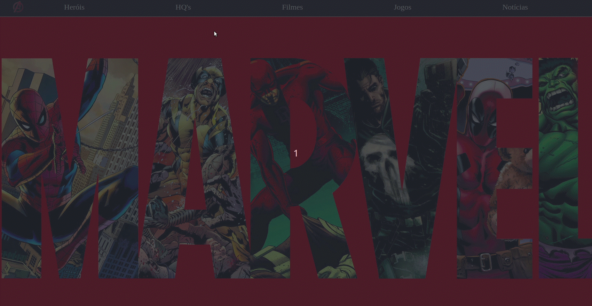

<h4 align="center"> 
	🚧 Marvel 🚀
</h4> 

<h1 align="center">
    
</h1>

  
  
  

## Marvel

Menu responsivo com Styled Components com o tema da marvel.

### Tecnologias

- responsividades
- reactjs
- styled components

### Tarefas

- [x] criar projeto: `npx create-react-app`
- [x] instalar styled components: `npm install styled-components`
- [x] criar componente Header
- [x] estilização global
- [x] componentes personalizados com sufixo Styled: header, logo, menuContent, menuIcon, menuContent
- [x] theme provider
- [x] media query
- [x] toggle menu
- [x] breakpoint em variáveis no arquivo media.js
- [x] favicon personalizado

### Layouts

  

 

  
  

 

### Warnings Resolvidos

- [substituído ReactDOM por createroot](https://bobbyhadz.com/blog/react-you-are-importing-createroot-from-react-dom)

### Styled Components

É uma biblioteca que permite utilizar `css in js` com [documentação](https://styled-components.com/) muito boa.

### `npm start`

Runs the app in the development mode.\
Open [http://localhost:3000](http://localhost:3000) to view it in your browser.

The page will reload when you make changes.\
You may also see any lint errors in the console.

### Learn More

You can learn more in the [Create React App documentation](https://facebook.github.io/create-react-app/docs/getting-started).

To learn React, check out the [React documentation](https://reactjs.org/).

### Inspiração

Esse projeto tem fonte no [vídeo](https://www.youtube.com/watch?v=pfsC1MPMJnY&list=PLs_UfelOxGL25jmkIJ4pU16Ku-jfdFGC4&index=8&t=1s).
